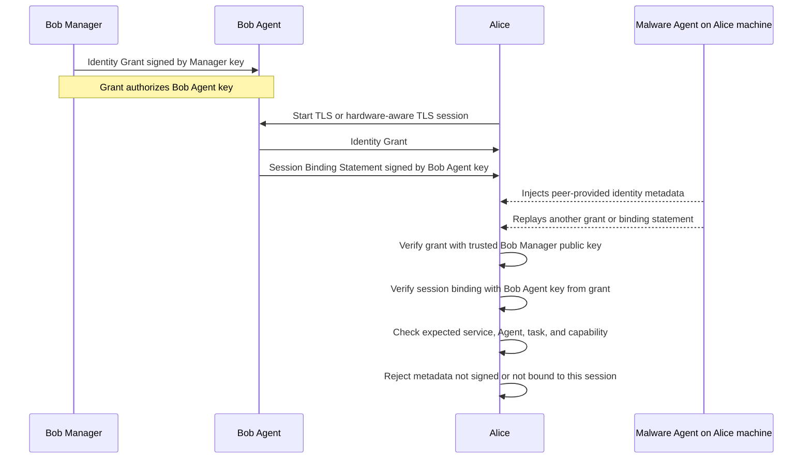

# Hardware-Aware TLS Identity Binding Profile

Draft v0.1.1

## Abstract

This profile binds upper-layer identity and authorization material to an
accepted TLS 1.3 session and to post-handshake platform-attestation facts. It is
application-protocol neutral at L0 through L2. Agent2Agent / AGTP is the first
reference target for the upper layers, not a replacement for the trust model
described here.

This profile is not a TLS extension. It is an application-profile acceptance
gate that consumes TLS 1.3, exported-authenticator, exporter, and attestation
results.

The core rule is simple: a verifier accepts a peer only when the peer's
authenticated identity, session binding, freshness state, and local policy all
refer to the same intended session, platform, service, agent, task, and
authority boundary.

## 1. Status

This is a repository security-hardening profile. It is not an IETF consensus
document and it does not define a new TLS handshake, a new attestation evidence
format, a new identity provider, or a new application core protocol.

Within this repository, this Markdown file is the normative source for the
profile. Rendered specifications, notes, reports, and tests are derived from it
unless they explicitly say otherwise.

The key words "MUST", "MUST NOT", "REQUIRED", "SHALL", "SHALL NOT",
"SHOULD", "SHOULD NOT", "RECOMMENDED", "NOT RECOMMENDED", "MAY", and
"OPTIONAL" are to be interpreted as described in BCP 14, RFC 2119 and RFC 8174
when, and only when, they appear in all capitals.

## 2. Terms

Hardware-aware TLS, as used in this repository, means an application-profile
acceptance gate over ordinary TLS 1.3 plus post-handshake platform attestation
and session binding. It is not a TLS extension. Platform attestation does not
replace the TLS handshake and does not authenticate the platform before a TLS
channel exists.

The older shorthand `aTLS` is reserved for existing Cocos implementation code
paths, package names, or historical text. New profile text should use
"hardware-aware TLS" unless it refers to that legacy surface.

Identity Grant means an authority statement issued by a Manager or another
locally trusted policy authority. It authorizes upper-layer identity, task, and
authorization values.

Session Binding Statement means a holder-of-key proof that binds one verified
Identity Grant to one accepted TLS or exported-authenticator session. It does
not authorize service, tenant, task, scope, resource, or capability values.

Expected values are verifier-local policy inputs. Observed values are values
extracted from authenticated grants, session-bound statements, attestation
claims, trusted manifests, or locally derived request state. Observed values do
not become expected values without a trusted local policy decision.

## 3. Scope

This profile covers the checks needed before an application treats an accepted
TLS peer as the intended platform, service, agent, task, or authorized actor.
It focuses on fail-closed binding across three classes of facts:

1. accepted TLS and post-handshake attestation facts;
2. authenticated identity and authorization material;
3. verifier-local expected policy.

Out of scope:

- selecting a specific identity provider;
- standardizing a concrete wire-token format;
- changing attestation evidence formats;
- changing lower-layer TLS or post-handshake attestation wire protocols;
- proving a complete end-to-end authorization model;
- defining generic OAuth, OIDC, JWT, JWS, CWT, or COSE behavior except where
  this profile relies on them for fail-closed acceptance.

A requirement belongs in this profile when omitting it could cause any of these
acceptance failures:

- a binding from the wrong live TLS or attestation session is accepted;
- the right platform is accepted for the wrong service, tenant, agent, task, or
  authority boundary;
- replay, stale state, missing state, or required-mode downgrade is accepted;
- peer-selected metadata becomes verifier policy;
- a security result, authorization decision, or verification result is reused
  outside the session or request for which it was produced.

## 4. Relationship to existing specifications

Most building blocks are already standardized. This profile composes them and
adds repository-specific fail-closed requirements for identity, session binding,
replay, canonical references, local policy comparison, and cache safety.

| Area | Existing specification | Profile decision |
| --- | --- | --- |
| Normative keywords | BCP 14: RFC 2119 and RFC 8174 | Keywords apply to this repository profile only. |
| OAuth roles and authorization vocabulary | RFC 6749 and RFC 9396 | Manager, Agent, relying party, `scope`, `resource`, and `authorization_details` are mapped by this profile. |
| JWT/JWS syntax and safety | RFC 7519, RFC 7515, and RFC 8725 | The two-token Identity Grant plus Session Binding Statement model, `agtp_type`, `agtp_version`, `grant_hash`, and the mandatory claim set are profile choices. |
| Proof-of-possession pattern | RFC 7800 and RFC 8705 | The Agent confirmation-key rule follows the PoP pattern. The exact Session Binding Statement claims are profile-specific. |
| TLS channel binding and exported authenticators | RFC 9266 and RFC 9261 | The profile consumes accepted lower-layer binding facts. It does not define a new TLS exporter or exported-authenticator format. |
| Remote attestation roles | RFC 9334 | The attestation-binder hash, accepted-evidence policy, and L1/L2 wiring are profile details. |
| CWT/COSE | RFC 8392 and RFC 9052 | CWT/COSE is an alternative encoding for the same semantics, not a different trust model. |
| HTTP response caching | RFC 9111 | The core rule is that security-state objects and verification results are not cacheable acceptance evidence. Detailed response-cache guidance is separated into `docs/http-cache-profile.md`. |
| OIDC | OpenID Connect Core | OIDC is vocabulary only. This profile does not require OIDC. |
| L0-L6, Identity Grant, Session Binding Statement, canonical references | Not standardized as one combined profile | These are local names for fail-closed identity binding. |

## 5. Threat model

The attacker can observe, replay, reorder, or relay network messages. The
attacker can provide malicious application metadata. The attacker can run
another Agent on the same machine or in the same deployment environment.

In the Alice-side example, malware may influence peer-provided metadata or try
to reuse old grants or binding statements. It does not fully control Alice's
verifier process, local policy store, OS sandbox, keychain, or trusted Manager
key configuration.

The lower layers are assumed to implement TLS 1.3 validation,
exported-authenticator validation, and platform-evidence appraisal correctly.
This profile defines the identity and policy material that must be bound to
those lower-layer facts before the application accepts the peer as the intended
Agent.

Out of scope for this threat model:

- a fully compromised verifier process or local policy store;
- a malicious or compromised trusted Manager or policy authority;
- compromise of all local secret storage, OS isolation, or keychain controls;
- denial of service;
- side-channel leakage outside the identity-binding path.

| Threat | Required design consequence |
| --- | --- |
| Network relay or borrowed attestation | Bind the verified grant to the accepted TLS exporter context, one-shot session binding, endpoint-key confirmation, and attestation-binder hash when present. |
| Replay of old grants or bindings | Use `iat`, `exp`, unique IDs, and one-shot nonce or binding state. Required-mode deployments fail closed when replay state is unavailable. |
| Same-machine wrong-Agent | Keep Manager keys and Agent confirmation keys in separate trust domains. Accept only a Session Binding Statement signed by the grant-authorized confirmation key or by a key explicitly authorized by local policy. |
| Peer-provided metadata injection | Build accepted identity only from authenticated grants, session-bound statements, and local expected policy. |
| Service, tenant, deployment, task, or capability diversion | Compare L3 through L6 values against local expected values. Required layers fail closed when expected values are missing or ambiguous. |
| Token substitution between grant and binding | Carry a domain-separated `grant_hash` over the exact signed grant bytes. Reject mismatched grant and binding pairs. |
| Key rotation, stale key, or revocation failure | Reject unknown, stale, retired, or revoked Manager keys, Agent binding keys, and grant IDs. Remote key sources need freshness and failure behavior. |
| Cache confusion or cross-authority leakage | Do not reuse identity tokens, binding statements, attestation evidence, authorization decisions, or verification results as acceptance evidence. |
| Gateway route confusion | In gateway-terminated deployments, authenticate the gateway-to-Agent route. Gateway session binding alone proves only the gateway endpoint. |
| Semantic alias or fuzzy-match confusion | Use canonical identifiers for decision-sensitive semantic values. Fuzzy matching, alias repair, or model interpretation is not an acceptance authority. |

If Alice's verifier, local expected-policy source, or trusted key store is fully
compromised, token design alone cannot recover security. Those cases require
host isolation, policy-file integrity, secret isolation, process isolation, and
operational controls outside this profile.

## 6. Layer model

The layer model separates lower-layer session and attestation binding from
upper-layer deployment, agent, task, and authorization policy. Other profiles
may collapse, rename, or extend these layers if they preserve the same
fail-closed checks.

| Layer | Verification target | Main failure class |
| --- | --- | --- |
| L0 | Live TLS channel | MITM or session confusion |
| L1 | Attested platform validity | Fake, malformed, or untrusted platform evidence |
| L2 | Attestation-to-channel or authenticator-to-channel binding | Relay, replay, or borrowed evidence |
| L3 | Intended service, tenant, deployment, or environment | Service or tenant diversion |
| L4 | Intended workload, process, or agent | Same-machine wrong-Agent |
| L5 | Intended task, thread, context, or delegation | Cross-task or context diversion |
| L6 | Intended authorization or capability policy | Confused deputy or privilege escalation |

L0 through L2 can be tested with transport, attestation, and implementation
regressions. L3 through L6 require explicit policy inputs before a verifier or
application layer can enforce them consistently.

## 7. Application-protocol boundary

TLS and the hardware-aware profile are responsible for L0 through L2:

- authenticating the live TLS channel;
- appraising attested platform or VM evidence;
- binding authenticator or attestation material to the accepted TLS session.

An application profile carries or references the upper-layer identity and
policy material needed for L3 through L6:

- intended service, tenant, deployment, or environment;
- intended workload, process, or Agent;
- intended task, thread, context, or delegation;
- authorization or capability policy.

Relay defense remains an L2 session-binding question. Diversion and wrong-Agent
prevention require L3 and L4 policy comparison. Task and capability checks then
continue at L5 and L6.

Current application-protocol drafts do not by themselves provide all semantic
binding needed for service, tenant, Agent, task, capability, canonical-reference,
replay, and local-policy checks. The application protocol may carry
authenticated policy inputs, such as an Identity Grant, and bind them to the
accepted TLS session through a Session Binding Statement. The verifier still
compares the resulting observed values with local expected values before
accepting the peer.

| Review item | Question | Profile requirement | Negative-test anchor |
| --- | --- | --- | --- |
| SP-01 | Is identity material bound to the accepted TLS and attestation session? | Verify the Session Binding Statement against the request/exporter context, grant hash, audience, nonce, endpoint-key confirmation, attestation binder when present, and replay state. | relay; binder mismatch |
| SP-02 | Which values are local policy and which are peer claims? | Compare service, tenant, deployment, agent, task, scope, resource, and authorization values against local expected policy. | diversion; wrong-Agent; binding confusion |
| SP-03 | Which freshness values are one-shot? | Reject repeated Session Binding Statement IDs, nonces, or task-binding values when one-shot use is required. | replay |
| SP-04 | What happens when grant or binding material is missing, unsupported, substituted, or partly verified? | Required mode fails closed. Neither Identity Grant nor Session Binding Statement is sufficient alone. | downgrade; nested-token substitution |
| SP-05 | Which responses are safe for shared caching? | Treat caller-dependent responses as `private` with adequate partitioning or `no-store`. Do not cache security inputs or verification results as acceptance evidence. | caller-dependent cache leak |
| SP-06 | Are semantic references canonical? | Reject non-canonical, ambiguous, fuzzy-matched, or receiver-repaired decision values. | semantic alias confusion |
| SP-07 | Are Manager and Agent keys separated? | Reject Manager keys used as Agent confirmation keys and Agent keys used as Manager signing keys. | key-role confusion |
| SP-08 | Is gateway routing authenticated? | In gateway mode, bind the gateway endpoint and the gateway-to-Agent route separately. | gateway route confusion |

## 8. Authority and key separation

One implementation profile used in this repository is:

```text
Identity Grant + hardware-aware TLS + OAuth/OIDC-style semantics + JWT/JWS encoding
```

OAuth and OIDC provide claim semantics and review vocabulary. JWT/JWS provides
one signed-token encoding. CWT/COSE provides a compact binary encoding for the
same trust model.

The profile keeps three key roles separate:

| Key role | Purpose |
| --- | --- |
| TLS endpoint key | Proves possession for the accepted TLS or exported-authenticator endpoint. |
| Agent binding key | Signs the Session Binding Statement that binds a verified grant to the accepted TLS session. |
| Manager or policy-authority key | Signs Identity Grants that authorize intended deployment, Agent, task, or capability values. |

These keys may be related by deployment policy, but they MUST NOT be treated as
the same key by default. The Manager key is a token-signing or policy-authority
key, not a TLS endpoint key.

Manager signing keys MUST NOT be accepted as Agent confirmation keys. Agent
confirmation keys MUST NOT be accepted as Manager or policy-authority signing
keys. A deployment MAY explicitly authorize an endpoint key for session binding,
but that authorization must come from the verified grant or from local policy;
it must not be inferred from the TLS session alone.

The JWS protected header `kid` is only a key-selection hint. Acceptance also
requires issuer, audience, algorithm allow-list, key status, key use, profile
version, token type, time validity, and local policy checks. The signing-method
allow-list MUST NOT include `none`.

## 9. Identity Grant

An Identity Grant authorizes the intended upper-layer subject. The initial wire
profile uses JWT/JWS and OAuth/OIDC-style claim names where they fit. Other
encodings, including CWT/COSE or a signed manifest, are acceptable only if they
preserve the same authority, freshness, canonicalization, and session-binding
rules.

An Identity Grant contains the deployment-specific equivalent of:

- profile token type, `agtp_type=agtp.identity-grant` in the current JWT/JWS
  implementation;
- profile version, `agtp_version=1` in the current JWT/JWS implementation;
- issuer, `iss`;
- subject, `sub`;
- audience, `aud`;
- unique grant ID, `jti` for JWT/JWS or `cti` for CWT/COSE;
- issued-at time, `iat`;
- expiration time, `exp`;
- Agent confirmation key, `cnf.kid` in the initial JWT/JWS profile;
- optional explicitly authorized endpoint keys;
- service, tenant, deployment, or environment values when L3 is required;
- workload, process, or Agent identity when L4 is required;
- computation, task, thread, or delegation IDs when L5 is required;
- canonical intent, capability, or ontology references when those values are
  decision-sensitive;
- scopes, resources, or authorization details when L6 is required;
- issuer key ID or key version when needed for key rotation.

The Agent is not the authority for service, tenant, deployment, task, scope,
resource, or capability values. Those values are accepted only when they appear
in a grant verified under a locally trusted Manager or policy-authority key and
then pass local policy comparison.

## 10. Session Binding Statement

A Session Binding Statement proves that the holder of the confirmation key named
in the verified grant bound that exact grant to the accepted TLS or
exported-authenticator session. It does not authorize identity or capability
values.

A generic accepted endpoint key is not sufficient unless the verified grant or
local attestation policy explicitly binds that key to the same Agent identity.

A Session Binding Statement contains the deployment-specific equivalent of:

- profile token type, `agtp_type=agtp.session-binding` in the current JWT/JWS
  implementation;
- profile version, `agtp_version=1` in the current JWT/JWS implementation;
- unique binding statement ID, `jti`;
- audience or relying-service ID, `aud`;
- issued-at time, `iat`;
- expiration time, `exp`;
- `grant_hash`;
- `leaf_public_key_sha256`;
- `tls_exporter_sha256`;
- `request_context_sha256`;
- `attestation_binder_sha256` when accepted attestation-to-channel evidence is
  present;
- one-shot nonce or unique binding value.

Binding means receiver-verifiable linkage to the accepted session and accepted
evidence. The statement does not need to embed a TLS session identifier when the
verifier can deterministically compare endpoint-key, exporter or request
context, attestation-binder, nonce, and replay fields.

The grant hash is computed over an unambiguous byte string. For the initial
encodings:

```text
SHA-256("agtp.identity-grant.jwt.v1" || NUL || exact-signed-grant-bytes)
SHA-256("agtp.identity-grant.cwt.v1" || NUL || exact-signed-grant-bytes)
```

For JSON-based formats, the verifier SHOULD hash the exact signed bytes. It
MUST NOT compute `grant_hash` by re-serializing JSON in the acceptance path.
Canonical CBOR/COSE is acceptable when the encoding profile defines the
canonical form.

When accepted attestation evidence includes an attestation-to-channel binder,
`attestation_binder_sha256` is REQUIRED in the Session Binding Statement and
must match the accepted binder. When no such binder exists in the lower-layer
session, the field is absent unless deployment policy requires it.

## 11. L2 Binding Construction

This section fixes the byte-level L2 binding construction for the v0.1
direct-Agent profile. A verifier MUST NOT replace these inputs with
peer-selected labels, inferred context, display names, or reserialized semantic
metadata.

> Related references: RFC 8446 for TLS 1.3 exporter behavior, RFC 9261 for
> exported authenticators, RFC 9266 for `tls-exporter` channel binding, RFC
> 9334 for RATS roles, and RFC 8725 for JWT BCP.

Inputs:

- `tls_connection`: the accepted TLS 1.3 connection after the handshake has
  completed;
- `exporter_label`: the ASCII string `Attestation`;
- `context`: the exact Exported Authenticator `certificate_request_context`
  bytes chosen by the verifier or by local application state;
- `leaf_spki`: the DER-encoded SubjectPublicKeyInfo of the accepted leaf
  certificate or exported-authenticator certificate;
- `H`: the TLS 1.3 authenticator hash associated with the negotiated cipher
  suite;
- `role`: the verifier-local role or direction for this authentication
  instance, for example `client-to-agent`;
- `protocol_id`: the upper protocol profile, for example `agtp-jwt-jws-v1`;
- `aud`: the relying-party audience;
- `grant_hash`: the domain-separated hash of the exact verified Identity Grant;
- `task_context`: verifier-local task, thread, delegation, route, capability,
  method, path, tenant, or resource values that affect local policy.

The accepted `context` bytes are canonical application context bytes. For this
profile they are constructed by the verifier, or by verifier-trusted local
application state, before acceptance:

```text
context = canonical(
  "hwtls-l2-context-v1",
  role,
  protocol_id,
  aud,
  grant_hash,
  task_context,
  verifier_nonce_or_attempt_id
)
```

`canonical(...)` is a deployment-defined byte encoding that is fixed by the
profile or local policy before verification. It MUST be unambiguous, length
delimited, and not derived from peer-provided aliases during acceptance.

Construction:

```text
EKM = TLS-Exporter(tls_connection,
                   label = "Attestation",
                   context = context,
                   length = 32)

leaf_public_key_sha256     = SHA-256(leaf_spki)
tls_exporter_sha256        = SHA-256(EKM)
request_context_sha256    = SHA-256(context)

attestation_binding        = H(leaf_spki || EKM)
attestation_binder_sha256 = SHA-256(attestation_binding)
```

`tls_exporter_sha256` is a mandatory Session Binding Statement field in the
v0.1 direct-Agent profile. It binds the statement to the current TLS exporter
secret without exposing the exporter value itself. `request_context_sha256` is
also mandatory and binds the statement to role, protocol, audience, grant, task,
delegation, capability, tenant, and freshness context.

`attestation_binder_sha256` is the Session Binding Statement's compact
reference to the accepted attestation-channel binding. It ties together four
facts that the verifier has already accepted or will check before acceptance:

- the accepted endpoint key, through `leaf_spki`;
- the current TLS exporter value, through `EKM`;
- the verifier-accepted request context, through the exporter `context` and the
  separately compared `request_context_sha256`;
- fresh attestation evidence or fresh verifier results, only when those
  evidence/results carry or verifiably reference the same `attestation_binding`,
  `report_data`, `nonce`, or challenge identifier.

The field is not a standalone freshness proof. A verifier MUST reject it if the
corresponding evidence or attestation results are stale, missing, untrusted, or
not bound to the same exporter value and request context.

`leaf_public_key_sha256` is endpoint-key confirmation. It is useful for
checking which TLS or exported-authenticator key was accepted, but it is not a
session-unique value and MUST NOT be used by itself as replay protection or as
proof that a Session Binding Statement belongs to this authentication instance.
The primary session binding is the TLS exporter output under the verifier's
accepted `context`, plus the grant hash, audience, one-shot nonce, and replay
state.

The current Go implementation serializes `leaf_public_key_sha256`,
`tls_exporter_sha256`, `request_context_sha256`, and
`attestation_binder_sha256` as lowercase hexadecimal SHA-256 values without a
`sha256:` prefix.

The attestation evidence or attestation results MUST be appraised against the
same `attestation_binding`. For evidence formats that expose a report-data or
nonce field, this repository's lower layer derives:

```text
report_data = SHA-512(attestation_binding)
nonce       = SHA-256(EKM)
```

The exporter label is verifier policy. A verifier MUST NOT accept a
peer-selected exporter label. Unsupported labels fail closed.

The verifier MUST compare `tls_exporter_sha256` with the accepted TLS exporter
value and MUST compare `request_context_sha256` with the exact accepted context
bytes. It MUST NOT infer either value from peer-provided metadata.

RFC 9266 `tls-exporter` channel binding identifies the TLS connection. That is
not enough when multiple authentication instances, tasks, Agents, capabilities,
HTTP/2 streams, or pooled requests share one TLS connection. This profile
therefore requires application-specific context binding in addition to the TLS
connection binding.

Reuse rules:

- a Session Binding Statement MUST NOT be replayed across different
  `context` values, tasks, delegations, capabilities, or relying-service
  audiences;
- replay cache entries are keyed over the verified grant hash, audience,
  TLS exporter hash, request-context hash, and nonce;
- HTTP/2 multiplexing and connection pooling MUST use distinct accepted
  `context` values and one-shot nonces for distinct authentication instances;
- TLS resumption creates a new accepted TLS connection and MUST NOT reuse a
  prior Session Binding Statement or attestation binder as acceptance evidence;
- 0-RTT data MUST NOT be accepted as profile-authenticated identity before the
  post-handshake binder and Session Binding Statement are verified;
- QUIC/TLS 1.3 is not automatically equivalent to this direct TLS profile; a
  QUIC profile MUST define its exporter API, context bytes, endpoint-key
  binding, replay rules, and gateway behavior explicitly;
- gateway-terminated deployments bind the client-to-gateway TLS endpoint only
  with this construction. They do not prove the final Agent process in the v0.1
  core profile.

Negative L2 cases:

| Case | Required result |
| --- | --- |
| Same grant, different TLS exporter | Reject: `tls_exporter_sha256` mismatch. |
| Same TLS connection, different task context | Reject: `request_context_sha256` mismatch. |
| Same endpoint key, different TLS session | Reject unless the exporter hash, context hash, nonce, replay state, and attestation binder all match the accepted instance. |
| Peer-selected exporter label | Reject: exporter label is verifier policy. |
| Missing `tls_exporter_sha256` | Reject in v0.1 direct-Agent JWT/CWT acceptance. |
| Missing `request_context_sha256` | Reject. |
| Missing `attestation_binder_sha256` when accepted attestation binding exists | Reject. |
| Reused nonce with same grant, audience, exporter hash, and context hash | Reject by replay state. |
| TLS resumption or 0-RTT using an old statement | Reject before profile-authenticated identity is accepted. |

Test vectors for this profile MUST include at least one positive vector and the
negative cases above. A positive vector records the exact signed grant bytes,
`grant_hash`, accepted `context` bytes, `tls_exporter_sha256`,
`request_context_sha256`, `leaf_public_key_sha256`, nonce, and, when attestation
is present, `attestation_binder_sha256`.

### 11.1 Attestation freshness minimum

This profile uses the RATS roles as follows: the Attester is the platform or
Agent endpoint that produces evidence; the Verifier appraises evidence or
attestation results against the accepted channel binding; the Relying Party
accepts identity only after verifier output and local policy both succeed.

Hardware evidence can describe a correct measurement and still be too old for
the current session. For that reason, freshness is not satisfied by measurement
matching alone.

Minimum requirements:

- the verifier or relying party MUST generate a fresh per-attempt challenge
  before accepting evidence or attestation results;
- the challenge MUST be bound to the accepted TLS exporter value and canonical
  application context from Section 11;
- the signed or measured attestation evidence MUST carry the derived
  `report_data` or `nonce` value from Section 10.1, or an equivalent
  verifier-defined value with the same channel and context binding;
- attestation results MUST be signed by a trusted verifier and MUST include or
  verifiably reference the same `attestation_binding`, `report_data`, `nonce`,
  or challenge identifier;
- evidence or results from an older handshake, task, context, challenge, or
  binding attempt MUST NOT be reused as acceptance evidence;
- evidence, attestation results, Session Binding Statement `iat`/`exp`, replay
  TTL, and maximum clock skew MUST be explicit verifier policy; a missing
  policy value fails closed;
- if an evidence format has no trusted timestamp, it is acceptable only for the
  current challenge and current authentication attempt;
- stale, unknown, or expired attestation collateral and TCB appraisal data fail
  closed.

Replay state SHOULD include the evidence nonce, attestation-result identifier,
or verifier challenge when the format exposes one, in addition to the verified
grant hash, audience, request-context hash, and Session Binding Statement nonce.

The implementation API passes the computed `EvidenceBinding` to both evidence
and attestation-result verifiers. A verifier that accepts results without
checking this binding is outside the production profile.

## 12. Verification model

The verifier performs authority checks, session-binding checks, replay checks,
and policy comparison in that order. The final accepted assertion is built only
from verified material.

1. Verify the Identity Grant under a trusted Manager or policy-authority key.
2. Check grant issuer, audience, profile version, token type, algorithm, key
   status, expiration, issued-at time, grant ID, and required scope or resource
   fields.
3. Verify the Session Binding Statement signature.
4. Check that the statement signer is the grant confirmation key or another
   endpoint key explicitly authorized by the verified grant or local policy.
5. Verify that `grant_hash` matches the exact verified Identity Grant bytes.
6. Verify that the statement audience matches the relying service or client.
7. Reject arbitrary accepted endpoint keys that are not explicitly bound to the
   same Agent identity by the verified grant or local attestation policy.
8. Compare the statement binding fields with the accepted TLS or
   exported-authenticator session.
9. Enforce replay policy for grant IDs, binding IDs, task-binding values, and
   nonces when one-shot use is required.
10. Construct the internal assertion only from the verified grant and binding
    statement.
11. Compare the assertion with local expected policy for every required layer.

`identitypolicy.ValidateAssertion` remains a comparator and binding freshness
checker. It does not parse wire tokens, verify signatures, select keys, rotate
keys, check revocation, or own replay storage. Those checks belong to the
component that authenticates external identity material before it returns an
observed assertion.

## 13. Policy model

Expected values and observed values stay separate.

- Expected values come from local policy, operator configuration, a trusted
  registry, a Manager, computation state, or a policy engine.
- Observed values come from a session-bound assertion built from authenticated
  grants, Session Binding Statements, attestation evidence, CoRIM metadata, EAT
  claims, agent manifests, authenticated request metadata, or authorization
  tokens.
- Verification compares observed values against expected values.
- Required layers fail closed when an expected value is missing, ambiguous, or
  only peer supplied.

A minimal policy object can be shaped as follows:

```yaml
identity_policy:
  mode: "disabled"        # disabled | required
  set_mode: "exact"       # exact | contains_all

  require:
    l3: false
    l4: false
    l5: false
    l6: false

  expected:
    service: ""
    tenant: ""
    deployment: ""
    environment: ""
    workload: ""
    agent: ""
    agent_public_key: ""
    computation_id: ""
    task_id: ""
    thread_id: ""
    delegation_id: ""
    intent_ref: ""
    capability_ref: ""
    ontology_id: ""
    scopes: []
    resources: []
    authorization_details: []
```

After external identity material has been authenticated, the verifier can build
an internal assertion:

```yaml
identity_assertion:
  issuer: "manager-or-policy-engine"

  values:
    service: "payment-agent"
    tenant: "tenant-a"
    deployment: "prod"
    environment: "asia-northeast1"
    workload: "settlement-worker"
    agent: "agent-a"
    agent_public_key: "sha256:..."
    computation_id: "cmp-..."
    task_id: "task-..."
    thread_id: "thread-..."
    delegation_id: "delegation-..."
    intent_ref: "intent:monthly-settlement"
    capability_ref: "capability:orders-read"
    ontology_id: "ontology:payments:v1"
    scopes:
      - "orders:read"
    resources:
      - "orders"
    authorization_details:
      - "purpose:monthly-settlement"

  binding:
    leaf_public_key_sha256: "..."
    tls_exporter_sha256: "..."
    request_context_sha256: "..."
    attestation_binder_sha256: "..."
    nonce: "..."
    issued_at: "..."
    expires_at: "..."
```

This assertion is not a wire format. It is a local representation used after
the caller has authenticated external identity material. `Assertion.Issuer` is
informational unless the observed-identity implementation has already verified
the corresponding issuer and trust anchor.

## 14. L3 through L6 policy fields

| Layer | Required question | Common expected values |
| --- | --- | --- |
| L3 | Is this the intended service, tenant, deployment, or environment? | service, tenant, deployment, environment, region, CoRIM or EAT deployment claims |
| L4 | Is this the intended workload, process, or Agent? | workload ID, Agent ID, process or binary hash, config or policy hash, Agent public key, routing target |
| L5 | Is this the intended task, thread, context, or delegation? | computation ID, task ID, thread ID, request context, delegation ID, callback binding, one-shot task state |
| L6 | Is the action authorized for this peer and context? | scope, resource, authorization details, capability token, policy decision, user consent, tool policy |

OIDC and OAuth-style names are useful analogies:

| Layer | OAuth/OIDC-style analogue |
| --- | --- |
| L3 | issuer, audience, tenant, hosted domain, deployment claim, environment claim |
| L4 | subject, client ID, workload identity, actor claim, confirmation key |
| L5 | nonce, state, transaction ID, request object, delegation token |
| L6 | scope, resource indicator, authorization details, policy decision, consent |

These analogies are not normative requirements. A deployment can source the
same expected values from configuration, a registry, CoRIM metadata, an EAT
claim, an agent manifest, or an application policy engine.

## 15. Canonical semantic references

Some L5 and L6 inputs are semantic references rather than raw labels:

- `ontologyId`: stable identifier for the vocabulary or policy namespace;
- `intentRef`: stable identifier for the intended task, intent, or action
  family;
- `capabilityRef`: stable identifier for an authorization capability or
  resource-action class.

These values are profile reference identifiers. They are not natural-language
prompts, display names, or peer-selected aliases.

Decision-sensitive semantic values MUST be canonical before they appear in an
Identity Grant, Session Binding Statement, local expected policy, or
authorization decision. The relying client, Manager, or local policy authority
resolves aliases before issuance or local policy comparison.

Receivers MUST validate canonical identifiers deterministically against
receiver-side policy, task state, trusted registry data, signed profile data, or
the underlying interaction/security protocol.

Profiles that use `ontologyId`, `intentRef`, `capabilityRef`, or equivalent
semantic references MUST define the registry namespace and registry version that
give those identifiers their meaning. The registry version may be carried
directly in the identifier, in `ontologyId`, in the Identity Grant, or in
verifier-local policy. It MUST be unambiguous before the final acceptance
comparison.

An identifier from one registry or registry version MUST NOT be treated as
equivalent to the same string from another registry or version unless a trusted
registry migration rule explicitly defines that equivalence. Registry lookup,
version pinning, migration rules, and deprecation status are verifier policy and
MUST fail closed when unavailable or unsupported.

Receivers MUST NOT normalize peer-provided decision-sensitive values during the
final acceptance path. They MUST NOT turn a peer-provided alias, display label,
natural-language phrase, case variant, URI variant, or model interpretation into
an accepted canonical identifier.

Alias handling is part of local policy:

- an alias resolves to exactly one normalized reference at the relevant registry
  or policy version;
- a missing alias, unsupported registry version, or ambiguous alias fails
  closed;
- case folding, Unicode normalization, URI normalization, or prefix expansion is
  allowed only when the referenced identifier scheme defines it;
- otherwise, normalized references are compared as exact strings;
- set-like fields, such as scopes, resources, and authorization details, use the
  configured set mode after normalization.

Free-form natural-language intent, context, or capability text MAY be carried
as descriptive metadata. It MUST NOT be decision-authoritative profile data.

## 16. Production profile

Production identity policy has two modes: disabled or required.

In disabled mode, the transport does not enforce L3 through L6 identity policy.
L0 through L2 lower-layer checks still apply according to the configured TLS and
attestation profile.

In required mode, the client fails closed when any required policy input is
missing, untrusted, expired, replayed, non-canonical, unsupported, revoked, or
inconsistent with the accepted TLS session. Peer-provided metadata is never
used as expected policy.

| Area | Required-mode behavior |
| --- | --- |
| Manager trust | Manager or policy-authority verification keys are configured locally by issuer, audience, `kid`, algorithm, key type, key use, key status, and public-key thumbprint, or loaded through an equivalent fail-closed key source. |
| Algorithm safety | The token `alg` must match local key policy. `none` is forbidden. Algorithm confusion is a hard failure. |
| Key separation | Manager signing keys and Agent confirmation keys are separate trust domains and MUST NOT be accepted interchangeably. |
| Grant lifetime | Identity Grants are short-lived and carry `iat`, `exp`, and a unique `jti` or `cti`. |
| Grant revocation | Deployments that require early invalidation reject revoked grant IDs and disabled Manager-key IDs before expiration. |
| Unknown keys | Unknown, disabled, retired, stale, wrong-use, or mismatched key IDs fail closed. |
| Session-binding signer | Session Binding Statements are signed by the confirmation key named in the verified grant, or by another key explicitly authorized by that grant or local policy. |
| Session-binding fields | Session Binding Statements carry accepted endpoint-key hash, TLS exporter hash, request-context hash, one-shot nonce, and attestation-binder hash when attestation binding is present. |
| Replay | JWT/CWT identity acceptance requires replay protection for binding nonces or one-shot IDs. A missing replay cache is a hard failure for one-shot acceptance APIs. Multi-instance production deployments use shared atomic insert-with-expiry semantics, such as `SET NX EX`. |
| Local policy | Required L3 through L6 values are compared against local expected policy. Missing expected values fail closed. L6 set-valued authorization fields default to exact set matching. |
| Error handling | Failure to check keys, revocation, session binding, replay, canonicalization, or local identity policy is an authentication failure, not a warning. |

The initial mandatory JWT/JWS claim set is:

| Token | Mandatory claims |
| --- | --- |
| Identity Grant | `agtp_type`, `agtp_version`, `iss`, `aud`, `sub`, `jti`, `iat`, `exp`, `cnf.kid` |
| Session Binding Statement | `agtp_type`, `agtp_version`, `aud`, `jti`, `iat`, `exp`, `grant_hash`, `leaf_public_key_sha256`, `tls_exporter_sha256`, `request_context_sha256`, `nonce`; also `attestation_binder_sha256` when attestation binding is present |

When identity is accepted from JWT/JWS material, the Session Binding Statement
JWT is REQUIRED. The Identity Grant JWT authenticates authority and semantics;
it does not prove that the authorized Agent key is present on the current TLS or
exported-authenticator session. The verifier accepts identity only after the
Session Binding Statement JWT is verified, linked to the exact signed Identity
Grant JWT, compared with the accepted session binding, checked for freshness and
replay, and compared with local expected policy.

CWT/COSE is a compact binary encoding for the same model. The grant issuer must
be trusted locally, the confirmation key must be named by the verified grant,
the COSE `kid` used for key lookup must be protected, and the binding statement
must bind the exact grant to the accepted session.

Replay mode is explicit:

| Replay mode | Valid use |
| --- | --- |
| `disabled` | Only when this identity profile is disabled or when a low-level helper is composing validation without making an acceptance decision. It is not valid for required-mode identity acceptance. |
| `local` | Single-process or test deployments where one in-process replay cache covers all accepted bindings. |
| `distributed_required` | Multi-process or multi-node production deployments. The store uses atomic insert-with-expiry semantics over `grant_hash`, `aud`, `tls_exporter_sha256`, `request_context_sha256`, and `nonce`. Store unavailability fails closed. |

The low-level `identitypolicy.MarkSessionBindingUsed` helper accepts a nil
cache so callers can validate first and mark replay state only after local
policy succeeds. Public one-shot acceptance helpers, such as
`VerifySessionIdentityJWT`, `VerifySessionIdentityJWTEnvelope`, and
`VerifySessionIdentityCWT`, require a replay cache.

## 17. Freshness, replay, key rotation, and revocation

JWT/JWS and CWT/COSE adapters verify signatures against caller-provided key
lookup policy. They do not define how Manager keys are rotated, how old keys are
retired, how grants are revoked before expiration, or where replay state is
stored. Deployments own those decisions.

Deployments using this profile define:

- a trusted issuer namespace for Manager or policy-authority keys;
- key identifiers, key-use rules, key-version rules, and key namespace rules;
- overlap windows for key rotation;
- revocation sources for grants, Manager keys, or Agent binding keys when early
  invalidation is required;
- maximum grant and session-binding lifetimes;
- clock-skew tolerance;
- replay-cache key shape;
- replay-cache retention at least as long as the accepted session-binding
  lifetime.

Revocation has three separate targets:

- grant revocation rejects a specific Identity Grant by JWT `jti` or CWT `cti`;
- Manager-key revocation rejects grants signed by a disabled issuer key or
  `kid`;
- Agent binding-key revocation rejects Session Binding Statements signed by a
  compromised or retired confirmation key.

Unknown, revoked, stale, wrong-use, or ambiguous keys fail closed. A deployment
that relies on JWKS or another remote key set must define freshness, cache
lifetime, pinning or trust anchors, and failure behavior for that key source.

The JWT or COSE `kid` value is never a global key name. It is a protected-header
selection hint inside a verifier-controlled namespace. Key lookup and key-cache
entries MUST be scoped by the equivalent of:

```text
profile_version || token_type || issuer || audience ||
key_use || alg || kty || kid || key_status || public_key_thumbprint
```

`key_use` distinguishes at least Manager or policy-authority signing keys,
Agent confirmation keys, and explicitly authorized endpoint keys. Two issuers
that publish the same `kid` do not identify the same key. A Manager signing key
and an Agent confirmation key with the same `kid` do not identify the same key.
The Identity Grant `cnf.kid` is a grant-scoped reference to the Agent
confirmation namespace; it is not a Manager-key lookup and not an authority by
itself.

Implementations that use callback-style key lookup receive only the bare
protected-header `kid` from the token parser. Those callbacks MUST apply the
same namespace using the verifier's expected issuer, audience, token type, key
use, algorithm allow-list, key type, key status, and public-key thumbprint. JWKS
or registry caches MUST NOT be keyed only by `kid`.

Replay state is marked only after signature validation, session-binding
comparison, freshness checks, and local policy comparison succeed. Failed
attempts may be logged or rate-limited, but they do not consume a one-shot
nonce unless deployment policy deliberately chooses that anti-probing behavior.

## 18. Core cache-safety rules

Response caching and security-state caching are different things.

Response caching stores endpoint results for reuse. Replay caches store one-shot
freshness state. Verified Identity Grants, Session Binding Statements,
attestation evidence, authorization decisions, and prior verification results
MUST NOT be cached as acceptance evidence for a later session or request.

The default for profile-sensitive endpoints is `no-store`. A shared response
cache MAY store a response only when the response is invariant across Agent ID,
principal, tenant, authority scope, policy grant, mTLS certificate identity,
attestation result, session binding, task state, and other verifier-local policy
inputs.

Private or partitioned cache hits do not bypass current security checks. A
verifier still authenticates the current Identity Grant, verifies the current
Session Binding Statement, checks replay state, and compares local policy before
using a cached response. Cache hit is a performance result, not an authorization
result.

The broader RFC 9111 response-cache profile is non-normative for core identity
binding and is kept in `docs/http-cache-profile.md`.

## 19. Privacy and correlation controls

Identity-binding data can become a correlation surface. Tenant IDs, deployment
names, task IDs, capability references, key fingerprints, grant IDs, route IDs,
and attestation-related identifiers can link sessions even when the cryptography
is correct.

Deployments SHOULD minimize stable cross-context identifiers. In particular:

- partition audiences so a grant or binding issued for one relying service is
  not useful or linkable at another relying service;
- prefer pairwise or audience-scoped Agent, task, grant, and key identifiers
  when global identifiers are not required for safety;
- keep grants and Session Binding Statements short-lived, but do not rely on
  short lifetime alone as the privacy control;
- avoid logging full grants, binding statements, key fingerprints, attestation
  evidence, task IDs, tenant IDs, and capability references unless needed for
  security audit;
- redact, hash with an audit-only salt, or separately protect correlation
  fields in logs;
- disclose only the L3 through L6 fields needed by the receiver's local policy;
- use selective disclosure or reference tokens when a deployment needs to prove
  one attribute without revealing unrelated tenant, task, capability, or
  deployment values.

## 20. Deployment topologies

### 20.1 Direct-Agent mode

In direct-Agent mode, the Agent terminates the TLS session and performs the
hardware-aware profile checks. The Agent signs the Session Binding Statement
with the confirmation key named by the verified Identity Grant, or with an
endpoint key explicitly authorized by the grant or local policy.

### 20.2 Gateway-routed mode

Gateway-routed mode is not part of the v0.1 core profile. Gateway session
binding proves the gateway endpoint, not the final Agent process. A
gateway-routed deployment needs a separate route assertion and replay model
before the relying party can treat the final Agent as accepted.

The non-core sketch is kept in `docs/gateway-routed-profile.md`. It should be
treated as v0.2 design work until route assertions, tenant partitioning,
gateway-to-Agent holder-of-key proof, and live gateway red-team tests are
implemented.

## 21. Implementation hooks

The production client hook is:

- `atls.ClientConfig.IdentityPolicy` for local expected values;
- `atls.ClientConfig.ObservedIdentity` for a session-bound observed assertion
  extracted from a trusted source.

The hook runs after exported-authenticator and attestation validation, but
before the accepted TLS connection is returned to the caller.

The client computes expected session binding from the accepted exported
authenticator and attestation result: the leaf public key, TLS exporter digest,
certificate request context, and attestation binder when attestation is present.
The observed assertion must carry matching binding values and a non-expired
`expires_at` value before its identity fields are compared with local policy.

The profile gives the client two defenses:

- relay defense: the observed assertion is tied to this accepted TLS session at
  L2;
- diversion defense: the session-bound observed identity matches locally
  expected deployment, Agent, task, and authorization values at L3 through L6.

## 22. Validation algorithm

For each layer required by policy:

1. Load the local expected value.
2. Reject if the expected value is missing, ambiguous, non-canonical, or only
   peer supplied.
3. Extract the observed session-bound assertion from an authenticated source.
4. Reject if the assertion is not bound to the accepted TLS session.
5. Reject if the assertion is expired or missing freshness metadata.
6. Extract the observed value for the required layer.
7. Reject if the observed value is missing or non-canonical.
8. Compare the observed value with the expected value.
9. Reject on mismatch.
10. Continue to the next required layer.

For set-like L6 values such as scopes, resources, or authorization details, the
observed set must satisfy local policy. The default `exact` mode rejects both
missing and extra observed values. `contains_all` is allowed only when local
policy or a policy engine explicitly permits surplus observed authorization
values for that endpoint, task, Agent, and resource. A peer-provided scope list
is not enough by itself.

Sender-constraining and replay checks prove possession and freshness. They do
not authorize surplus scopes, resources, capabilities, or authorization details.
L6 authorization semantics remain a separate local-policy decision.

## 23. Error handling and diagnostics

Validation failures preserve the layer, field, and error class. Callers can
distinguish local policy configuration errors from missing peer claims,
mismatched values, stale keys, replay, unsupported profile versions, and binding
mismatches.

Aggregated validation errors remain inspectable by layer and field so callers
can fail closed while still reporting actionable diagnostics.

The validator rejects unsafe identity-policy values, including invalid UTF-8,
control characters such as CRLF, and HTML delimiter characters. It limits
individual values to 1024 bytes and set-like fields to 128 values. Validation
errors report only layer, field, and error class; they do not echo raw peer
values. HTTP or HTML presentation layers still need normal output escaping and
CSRF protections.

## 24. Minimal implementation path

A small implementation can be staged without changing the lower-layer TLS or
post-handshake attestation wire protocol:

1. Define a local policy input structure for L3 through L6 expected values.
2. Define extraction points for observed values.
3. Authenticate the observed identity material before constructing an internal
   assertion.
4. Add fail-closed validators for exact-match string fields.
5. Add set-containment or exact-set validation for scopes, resources, and
   authorization details.
6. Add replay-cache support for one-shot binding nonces or IDs.
7. Wire validation before treating an accepted peer as the intended deployment,
   Agent, task, or authorized actor.

The lower-layer verifier can remain focused on L0 through L2. L3 through L6
enforcement belongs at the layer that has deployment policy, Agent metadata,
computation state, and authorization decisions.

## 25. Implementation status

The reusable validator lives in `pkg/atls/identitypolicy`. It implements the
expected-versus-observed comparison model and session-bound assertion validation
described in this profile. The client transport calls it when
`atls.ClientConfig.IdentityPolicy` is enabled.

The same package provides `identitypolicy.NewAssertionFromSessionBinding` for
the post-authentication step. It builds an internal `Assertion` from an already
authenticated Identity Grant and an already-verified Session Binding Statement.
It does not parse wire tokens or verify signatures. Before policy comparison,
the statement must be tied to the grant, audience, allowed confirmation key, and
minimum session-binding fields. `identitypolicy.SessionBindingOptions` can
attach a replay cache for one-shot binding nonces.

The client config supports two integration styles. Callers can provide a custom
`ObservedIdentity` callback, or they can pass a verified Identity Grant, a
verified Session Binding Statement, and an optional replay cache directly on
`atls.ClientConfig`. In both cases, the transport validates the resulting
assertion against the accepted TLS session before returning the connection. For
the direct grant/statement path, replay-cache marking happens only after
session-binding and local policy comparison succeed.

`pkg/agtp` provides concrete JWT/JWS and CWT/COSE wire-token adapters. The
JWT/JWS adapter verifies Identity Grants and Session Binding Statements using
locally configured issuer, audience, signing methods, and key lookup policy. It
does not choose trusted Manager keys, rotate keys, perform revocation, define
deployment policy, or own distributed replay storage.

The initial JWT/JWS adapter treats grant `cnf.kid` as the authorized
session-binding signer key. The Session Binding Statement signer is taken from
the protected JWS `kid` header and later checked by `identitypolicy` against the
verified grant. Thumbprint-based confirmation, such as `cnf.jkt`, can be added
when a deployment defines how key thumbprints map to local verification keys.

For callers that want one fail-closed acceptance gate, `pkg/agtp` exposes
`VerifySessionIdentityJWT`. That helper verifies the Manager-signed Identity
Grant, verifies the Session Binding Statement, checks binding-signer
authorization, compares the resulting assertion with local expected
`identitypolicy.Policy` values and the accepted TLS session binding, and only
then marks the binding nonce in the replay cache.

The implemented production profile covers:

- trusted Manager or policy-authority key lookup for Identity Grants through
  `JWTVerifyOptions`;
- issuer, audience, signing-method, `kid`, expiration, issued-at, token type,
  profile version, and `jti` checks;
- confirmation-key binding through Identity Grant `cnf.kid`;
- Session Binding Statement signer authorization against the verified grant;
- comparison with the accepted TLS endpoint key, request context, and optional
  attestation binder;
- local `identitypolicy.Policy` comparison for required L3 through L6 values;
- replay-cache enforcement before the observed identity is accepted.

Deployment still chooses trusted keys, expected policy values, revocation data,
and distributed replay storage. Those sources can be Manager configuration,
Agent metadata, computation state, an authorization policy engine, or a
fail-closed registry integration. They must not be raw peer-controlled metadata.

## 26. Evaluation boundary

Negative test vectors, unit tests, and dependency-free live-style harnesses are
necessary, but they are not sufficient evidence for the full security claim.
The profile's central claim is receiver-verifiable linkage: the verified grant,
Session Binding Statement, accepted session, attestation result, replay state,
and local expected policy all describe the same intended interaction.

An implementation that claims this profile should evaluate at least:

- relay attacks with real network endpoints and an active relay;
- borrowed hardware attestation across sessions;
- token substitution and cross-JWT or cross-envelope confusion;
- multiple tasks over one TLS connection;
- HTTP/2 or gRPC connection reuse;
- TLS resumption and 0-RTT behavior;
- distributed replay-cache races under multi-node storage;
- gateway route confusion when gateway-routed mode is enabled;
- fuzzing of JWT claims, Unicode values, duplicate JSON keys, malformed
  protected headers, malformed base64url, and malformed JWS structure;
- a small model or property test for the invariant that a grant is accepted
  only with the intended binding, session, and local expected policy.

`docs/live-red-team-report.md` records which of these are covered by the current
repository and which remain future evaluation work.

## Appendix A. Identity Grant JWT claim map

The initial JWT/JWS profile uses two signed JWTs for different authority
questions:

- Identity Grant JWT: a Manager or policy authority signs upper-layer identity,
  task, and authorization values that the peer is allowed to claim.
- Session Binding Statement JWT: the Agent confirmation key signs a
  holder-of-key statement binding the verified grant to the accepted TLS
  session.

The Session Binding Statement JWT does not authorize service, tenant, task,
scope, resource, or capability values. Those semantic values belong in the
Identity Grant JWT and are accepted only after local policy comparison.

| Identity Grant JWT field | Source or form | Purpose | Layer |
| --- | --- | --- | --- |
| JWS protected header `kid` | Manager or policy-authority signing key ID | Select the local verification key for the signed grant. The value is only a key-selection hint. | prerequisite |
| JWS protected header `alg` | locally allowed signing method | Prevent algorithm confusion. `none` is forbidden. | prerequisite |
| `agtp_type` | `agtp.identity-grant` | Distinguish the grant token from other repository profile tokens. | profile guard |
| `agtp_version` | `1` | Reject unsupported wire-profile versions before interpreting claims. | profile guard |
| `iss` | trusted Manager or policy authority | Identify the authority that issued the grant. | prerequisite |
| `aud` | relying service or application profile audience | Ensure the grant was issued for this verifier or application profile. | prerequisite |
| `sub` | upper-layer subject, usually the Agent when `agent` is absent | Provide the subject authorized by the grant. | L4 |
| `jti` | unique grant ID | Support grant uniqueness, revocation, diagnostics, and replay-sensitive handling. | freshness |
| `iat` | issued-at time | Detect future-issued or malformed grants and support freshness decisions. | freshness |
| `exp` | expiration time | Bound the lifetime of the authority statement. | freshness |
| `cnf.kid` | Agent confirmation key ID | Name the key allowed to sign the Session Binding Statement for this grant. | L4 / L2 prerequisite |
| endpoint keys | optional endpoint key IDs | Claim: `authorized_endpoint_keys`. Allow explicitly named endpoint keys when the deployment uses that binding model. | L4 / L2 prerequisite |
| `service` | application service name or ID | Bind the grant to the intended service. | L3 |
| `tenant` | tenant or account ID | Bind the grant to the intended tenant. | L3 |
| `deployment` | deployment, region, cluster, or environment slice | Bind the grant to the intended deployment target. | L3 |
| `environment` | production, staging, development, or similar | Bind the grant to the intended environment class. | L3 |
| `workload` | workload, process, or component ID | Bind the grant to the intended workload. | L4 |
| `agent` | Agent identity | Bind the grant to the intended Agent rather than any peer on the same platform. | L4 |
| `agent_public_key` | stable Agent public-key reference or fingerprint | Bind the Agent identity to a specific key when required by policy. | L4 |
| `computation_id` | computation or job ID | Bind the grant to a computation instance. | L5 |
| `task_id` | task ID | Bind the grant to the intended task. | L5 |
| `thread_id` | thread, conversation, or workflow ID | Bind the grant to the intended thread or workflow context. | L5 |
| `delegation_id` | delegation token or delegation record ID | Bind the grant to a specific delegation chain or authorization handoff. | L5 |
| `intent_ref` | stable intent reference | Bind the grant to a canonical task or intent family. | L5 |
| `capability_ref` | stable capability reference | Bind the grant to a canonical capability or resource-action class. | L6 |
| `ontology_id` | stable policy vocabulary or namespace ID | Identify the vocabulary used to interpret semantic references. | L6 |
| `scope` / `scopes` | OAuth-style scope values | State coarse authorization strings for local policy comparison. | L6 |
| `resource` / `resources` | resource indicators or resource URIs | State the resources the grant may be used against. | L6 |
| `authorization_details` | profile-specific authorization detail strings | Carry fine-grained authorization constraints. | L6 |

## Appendix B. Session Binding Statement JWT claim map

The Session Binding Statement JWT carries session facts, not semantic authority.
A verifier that accepts JWT/JWS identity material MUST verify this JWT under the
Agent confirmation key authorized by the verified Identity Grant and MUST reject
missing, mismatched, expired, replayed, non-canonical, or unsupported binding
material.

| Session Binding Statement JWT field | Source or form | Purpose | Layer |
| --- | --- | --- | --- |
| JWS protected header `kid` | Agent confirmation or explicitly authorized endpoint key ID | Select the candidate binding-signature key. The key is accepted only if authorized by the verified grant or local policy. | L2/L4 prerequisite |
| JWS protected header `alg` | locally allowed signing method | Prevent algorithm confusion. `none` is forbidden. | prerequisite |
| `agtp_type` | `agtp.session-binding` | Distinguish the binding token from grants, envelopes, or unrelated JWTs. | profile guard |
| `agtp_version` | `1` | Reject unsupported wire-profile versions before interpreting binding fields. | profile guard |
| `aud` | relying service or application profile audience | Ensure the statement was issued for this verifier or profile. | L2 prerequisite |
| `jti` | unique binding statement ID | Support diagnostics and one-shot replay handling. | freshness |
| `iat` | issued-at time | Detect future-issued or malformed binding statements. | freshness |
| `exp` | expiration time | Bound the lifetime of the session proof. It should not exceed the grant lifetime. | freshness |
| `grant_hash` | domain-separated hash of exact signed Identity Grant bytes | Bind the statement to the exact Manager-signed grant that was verified. | L2 |
| `leaf_public_key_sha256` | hash of accepted TLS or exported-authenticator endpoint public key | Confirm the accepted endpoint key. This is auxiliary and is not session-unique by itself. | L2 |
| `tls_exporter_sha256` | SHA-256 of the accepted TLS exporter output for label `Attestation` and the accepted context bytes | Bind the statement to the current TLS exporter value without exposing the exporter value. | L2 |
| `request_context_sha256` | SHA-256 of the exact canonical application context accepted for the Exported Authenticator `certificate_request_context` bytes | Bind the statement to the application-specific authentication instance. | L2 |
| `attestation_binder_sha256` | SHA-256 of `attestation_binding = H(leaf_spki || EKM)`, when present | Bind the statement to the accepted endpoint key, TLS exporter value, verifier request context, and fresh evidence or verifier results that reference the same binding. | L2 |
| `nonce` | one-shot nonce or unique binding value | Prevent replay of an otherwise valid binding statement. | freshness |

The receiver compares these fields as strict, already-canonical values. It does
not repair aliases, reserialize JSON to compute `grant_hash`, infer missing
binding fields from peer metadata, or treat a valid Identity Grant JWT as
session-bound without the Session Binding Statement JWT.

## Appendix C. Authority separation and envelope packaging

A deployment may package the Manager-signed Identity Grant inside, or alongside,
the Agent-signed Session Binding Statement so an implementation passes around
one envelope. Packaging does not merge authorities. The verifier still validates
the Manager or policy-authority signature on the grant, validates the Agent
confirmation-key signature on the session binding, checks that the binding names
the exact verified grant, and compares the resulting assertion with local
policy.

Moving semantic grant fields directly into an Agent-signed Session Binding
Statement would make the Agent the authority for service, tenant, task, scope,
resource, and capability claims. That changes the trust model and is unsafe for
profiles that need Manager- or policy-authority-issued authorization.

A single Manager-signed JWT that also includes session-binding values is
possible only when the Manager participates in, or is given trustworthy evidence
of, the per-connection TLS binding. That design adds an online authority
dependency and moves replay and freshness responsibilities to the Manager path.

The two-JWT design adds one additional JWS verification plus a domain-separated
hash over the exact compact Identity Grant JWT bytes. This is usually small
compared with TLS setup and attestation verification. Verifiers MUST NOT cache a
verified Identity Grant as acceptance evidence across sessions. Internal
optimization must still re-check signature, expiration, revocation state,
profile version, issuer, audience, grant hash, fresh Session Binding Statement,
replay state, and local policy for each accepted session.

The reusable `pkg/agtp` JWT/JWS adapter also supports a single-envelope
verification path. In that profile, the outer envelope is signed by the Agent
binding key and carries the exact inner Manager-signed Identity Grant JWT plus
the session-binding fields. The verifier still authenticates the inner Manager
grant, authenticates the outer Agent binding statement, compares the outer
`grant_hash` with the exact inner grant bytes, enforces replay and freshness,
and compares the resulting assertion with local policy. Agent-signed semantic
claims in the outer envelope are not Manager authorization. The current runtime
client configuration remains wired to the two-token JWT/JWS profile unless a
caller explicitly uses the envelope verifier.

## Appendix D. Non-normative trust-flow example



Bob Manager issues an authorization grant for Bob Agent. Bob Agent communicates
with Alice and binds the Manager grant to the current TLS or hardware-aware TLS
session. Malware on Alice's machine can try to inject peer-provided metadata or
reuse an old grant or binding statement, but it cannot create a valid
Manager-signed grant or Bob-Agent-key-signed session binding for the current
accepted session.

Alice accepts only the Manager-signed grant and the Agent-signed session binding
after local expected service, Agent, task, and capability checks pass. This does
not protect a fully compromised Alice process or local policy store.
