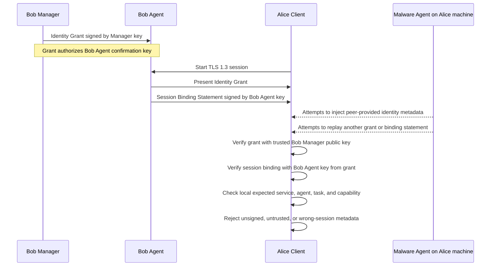

# Hardware-Aware TLS Identity-Binding Architecture

This architecture note covers the key split for hardware-aware TLS identity
binding: TLS and attestation establish lower-layer facts, while application
policy decides whether those facts describe the intended peer. AGTP is one
reference target, not the owner of this security-hardening profile. The layer
split is one decomposition; terminology, layers, and verification order are
defined in `docs/SSOT.md`.

Hardware-aware TLS means an application-profile acceptance gate over ordinary
TLS 1.3 plus post-handshake platform attestation and session binding. It is not
a TLS extension. TLS establishes the encrypted channel first. The profile then
decides whether the application may treat that channel as an attested
application peer.

## Roles

- Client: the relying party that accepts an application peer only after the
  lower-layer and profile checks succeed.
- Peer: the endpoint reached over the accepted TLS session.
- Manager or policy authority: the local trust anchor that signs Identity
  Grants.
- Agent binding key: the confirmation key named by a verified grant and used
  to sign a Session Binding Statement.
- Verifier: the component that compares observed session-bound identity values
  against local expected policy.

Manager or policy-authority signing keys and Agent binding keys are separate
trust domains. The profile requires separate verification policy for them so
that an Agent cannot authorize itself and a Manager key is not reused as an
Agent presence key.

## Layer Split

The profile keeps the lower TLS and attestation facts separate from application
policy.

| Layer | Responsibility | Primary failure class |
| --- | --- | --- |
| L0 | Authenticate the live TLS channel | MITM or session confusion |
| L1 | Appraise platform or VM evidence | fake or malformed platform evidence |
| L2 | Bind attestation or authenticator material to the accepted TLS session | relay, replay, borrowed evidence |
| L3 | Check intended service, tenant, deployment, or environment | service / tenant diversion |
| L4 | Check intended workload, process, or agent | wrong-agent |
| L5 | Check task, thread, context, or delegation | cross-task replay or context diversion |
| L6 | Check authorization or capability policy | confused deputy |

An application protocol, including AGTP, may carry profile material, but it must
not make peer-controlled metadata authoritative. The verifier compares
session-bound observed values against local expected values.

## Profile Objects

Identity Grant:

- signed by a Manager or policy authority;
- names the intended deployment, agent, task, and capability values;
- names the confirmation key that may bind the grant to an accepted TLS
  session;
- has issuer, audience, expiry, issued-at time, and unique token id.

Session Binding Statement:

- signed by the confirmation key named by the verified grant;
- includes a hash of the verified Identity Grant;
- includes the accepted TLS session binding values;
- includes a fresh nonce or replay-cache key;
- expires quickly.

Observed Identity Assertion:

- derived only after both objects verify;
- passed to local identity policy;
- rejected if required local expected values do not match.

Normalized reference values:

- governed by `docs/SSOT.md`;
- include canonical semantic identifiers such as `intentRef`,
  `capabilityRef`, and `ontologyId`.

Static Diversion Policy:

- governed by `docs/static-diversion-policy.md`;
- distinguishes allowed, denied, client-visible, and hidden diversion.

## Data Flow

1. The client establishes the TLS 1.3 session.
2. The post-handshake hardware-attestation gate verifies platform-attestation and
   session-binding facts.
3. The peer presents an Identity Grant and a Session Binding Statement.
4. The verifier authenticates both objects under local trust policy.
5. The verifier checks replay state.
6. The verifier derives an observed identity assertion.
7. Local identity policy compares observed values with expected values.
8. The application session is accepted only if all required checks pass.

The diagram below shows the intended key separation in the direct-Agent case.
The Manager issues authority, while the Agent only proves possession of the
confirmation key for the accepted session. Malware on the client machine may
try to inject metadata or replay profile material, but it cannot make those
values authoritative unless it can produce the required Manager-signed grant
and Agent-signed session binding.

Gateway-routed deployments are separate from the direct-Agent flow above. A
gateway TLS session proves the gateway endpoint, not the final Agent process.
The SSOT defines the required gateway route assertion fields, replay handling,
tenant partitioning, and Agent holder-of-key conditions for that topology.

## Audit

Implementations should log security-profile decisions without logging secrets.
Useful fields include:

- profile version;
- grant issuer;
- grant id;
- session binding id;
- accepted key fingerprint;
- expected policy name or id;
- failure class;
- failure reason.

## Non-Goals

AGTP transport behavior, generic OAuth/OIDC behavior, discovery semantics, and
complete authorization systems are outside this architecture.
